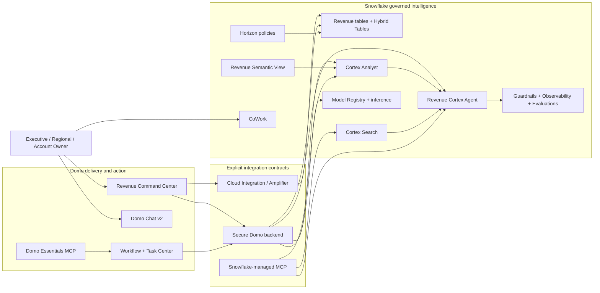
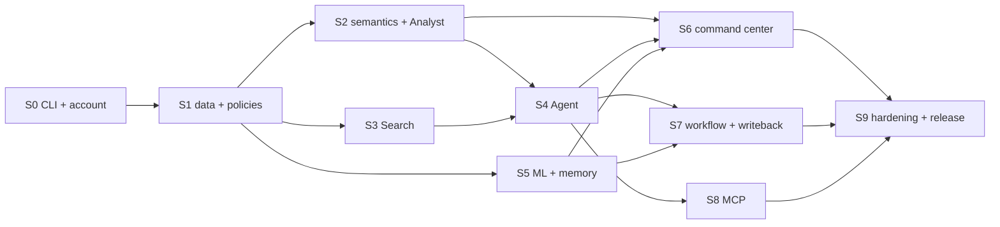

# Snowflake Revenue Command Center — Sprint Engineering Plan

## Purpose

Turn the selected governed multi-surface shape into a demo-grade, live Snowflake + Domo solution through vertical, demo-able increments.

This plan sequences implementation only. Product intent remains in:

- `snowflake-revenue-command-center-shaping.md` — original shaping document.
- `snowflake-revenue-command-center-reconciled-shaping.md` — evidence-backed capability and gap analysis.
- `snowflake-revenue-command-center-frame.md` — problem and outcome.

Research cutoff for the source analysis: 2026-07-15. Revalidate preview/beta behavior at implementation time.

## Non-negotiable Snowflake engineering policy

**Snowflake Cortex CLI (CoCo) is the only interface used for Snowflake research, design, creation, modification, testing, inspection, and deployment.**

This applies to:

- Databases, schemas, warehouses, roles, grants, tables, views, Hybrid Tables, stages, and tasks.
- Row access policies, masking policies, tags, classifications, and governance checks.
- Semantic views, verified queries, Cortex Analyst testing, and evaluation.
- Cortex Search services and ingestion/indexing pipelines.
- Cortex Agents, tools, instructions, threads, monitoring, and evaluations.
- Model training, Model Registry, inference, observability, and promotion.
- Managed MCP servers, tool specifications, OAuth requirements, and validation.
- All Snowflake due diligence, documentation lookups, object discovery, and troubleshooting.

Prohibited Snowflake paths:

- No manual Snowflake development in Snowsight.
- No direct `snow sql`, JDBC/ODBC, Python connector, REST administration, or hand-executed SQL for Snowflake development outside Cortex CLI.
- No external research used as the deciding authority for Snowflake behavior; ask Cortex CLI and preserve its evidence.
- Domo development may use Domo-native tooling, but any Snowflake-side change or investigation must return to Cortex CLI.

Supported runtime integrations may call Cortex Agent/Analyst, SQL, inference, Search, and MCP APIs after Cortex CLI creates, validates, and governs their contracts. Local SQL, YAML, Python, and configuration files are allowed as versioned artifacts only when Cortex CLI generates, updates, validates, or deploys them.

## Cortex CLI change protocol

Every Snowflake story follows the same five-step control:

1. **Ask** — use Cortex CLI documentation/object discovery to verify the current mechanism, account support, prerequisites, and existing objects.
2. **Plan** — ask Cortex CLI for the proposed object graph, exact changes, privileges, tests, rollback, and cost implications.
3. **Review** — save generated definitions locally and review the diff before execution.
4. **Apply** — instruct Cortex CLI to execute the approved Snowflake changes.
5. **Prove** — use Cortex CLI to inspect objects, run tests, capture results, and export the deployed definition.

Required evidence per story:

- Cortex CLI research question and dated answer.
- Before-state inventory.
- Generated change artifact or object specification.
- Post-deploy `SHOW`/`DESCRIBE`/test evidence gathered through Cortex CLI.
- Rollback command or previous exported definition.
- Preview/GA status and target-account availability.

## Cortex CLI baseline observed during planning

- CLI: Cortex Code v1.0.73.
- Active connection: `default`.
- Account: `DOMOINC-DOMOPARTNER`.
- User: `CASSIDY.HILTON@DOMO.COM`.
- Role: `SYSADMIN`.
- Cortex CLI discovered four existing agents across unrelated databases:
  - `ALPHA_FMC.ALPHA_FMC_SCHEMA.ALPHA_FMC_AGENT`
  - `DOMO_MMM_DATABASE.WRITING_SCHEMA.PREMIUM_DOMO_MMM`
  - `DATA_ENGINEERING_DEMO.BRONZE.DOMO_SF_INTELLIGENCE`
  - `GP_CAPSTONE.GOLD.SHARKNINJA`
- No dedicated Revenue Command Center agent was identified.
- Cortex CLI documentation search confirmed bundled workflows for semantic views, Cortex Agents, Cortex Search, machine learning, governance, lineage, cost intelligence, and AI-readiness scoring.
- Direct Cortex CLI discovery commands returned successfully. Two broad non-interactive `-p` research runs did not complete within several minutes; Sprint 0 must establish a reliable interactive/batch convention before automation depends on it.

## Working architecture

## Delivery model

- Sprint length: one week.
- Total planned implementation: 10 sprints, including Sprint 0.
- Every sprint ends in visible, presenter-demo-able behavior.
- No sprint is considered complete with only backend objects.
- Capability-gated work uses a live/fallback decision by the sprint exit; unsupported paths are labeled, not simulated as delivered.

## Shared Definition of Done

Every sprint must satisfy all applicable items:

- Snowflake research and changes completed through Cortex CLI.
- Generated Snowflake artifacts exported and versioned.
- Object ownership, grants, caller identity, and cost-bearing compute documented.
- Automated happy-path, negative, role-scope, and cleanup tests pass.
- No secrets in browser code, repository files, logs, or screenshots.
- UI reports live, fallback, preview, and error states truthfully.
- Presenter path demonstrated from the published Domo experience.
- Runbook, architecture, and shaping decisions updated if implementation changes the mechanism.
- Rollback/reset procedure tested.

---

## Sprint 0 — Cortex CLI control plane and account readiness

### Goal

Make Cortex CLI a reliable, auditable engineering interface and close account-level unknowns before creating product objects.

### Work

**Snowflake via Cortex CLI**

- Establish the project connection/profile, working database naming, role strategy, warehouse strategy, and evidence-log convention.
- Inventory databases, schemas, roles, warehouses, semantic views, agents, search services, models, Hybrid Tables, MCP servers, row policies, masking policies, event tables, and budgets.
- Ask Cortex CLI to verify regional/account support and current maturity for every selected Snowflake capability.
- Resolve the long-running headless `-p` behavior; choose an interactive session, bounded prompt, or direct subcommand convention that reliably returns output and can be logged.
- Ask Cortex CLI for the dependency graph, privilege matrix, cost-bearing resources, and teardown order.

**Domo**

- Confirm target instance, App Studio/pro-code access, Code Engine, Workflow, Task Center, Chat v2, AI Readiness, Cloud Integration, AI Toolkits, and Essentials MCP availability.
- Confirm whether Chat v2 and Essentials MCP are enabled or require provisioning.

### Deliverables

- Cortex CLI operating procedure.
- Account inventory and capability matrix.
- Naming convention and environment map: development, demo, optional production.
- Role/privilege design draft.
- Cost and cleanup guardrails.
- Go/no-go decisions for Domo Chat v2 and Domo Essentials MCP.

### Demo

Run one Cortex CLI object discovery, one documentation due-diligence query, and one harmless Snowflake context query; show the recorded evidence and target architecture inventory.

### Exit criteria

- Cortex CLI reliably performs bounded read-only and change-plan sessions.
- Every planned Snowflake object has an owner, prerequisite, test path, and teardown path.
- No critical account or Domo entitlement is unknown.

---

## Sprint 1 — Governed revenue data foundation

### Goal

Create the Snowflake-native Tessera Cloud revenue scenario and prove role-aware governed access before adding AI.

### Work

**Snowflake via Cortex CLI**

- Create project database, schemas, warehouses, custom roles, grants, tags, and cost controls.
- Generate and load synthetic dimensions/facts for accounts, products, incidents, revenue, usage, support, renewal risk, entitlements, and agent actions.
- Create six curated analytic views analogous to the reference story.
- Create `scenario_runs` and `prediction_feedback` Hybrid Tables.
- Create entitlement mapping, row access policy, and masking policy.
- Ask Cortex CLI to test two real role/persona outcomes and inspect policy propagation.
- Generate data-quality, row-count, referential-integrity, and incident-pattern tests.

**Domo**

- Configure the Snowflake Cloud Integration/Amplifier connection.
- Register the minimum datasets needed for the Forecast Home.
- Create an early published shell showing live/fallback status.

### Deliverables

- Versioned Snowflake data and policy artifacts generated by Cortex CLI.
- Synthetic-data validation report.
- Persona access test matrix.
- Live Domo dataset mappings.

### Demo

Switch between Executive and West Regional personas and show different permitted data from the published Domo shell, with Snowflake policy evidence.

### Exit criteria

- Incident `INC-0001` produces the expected West renewal-risk pattern.
- Hybrid Table CRUD works through Cortex CLI.
- Two-role policy tests pass.
- Domo reads live Snowflake data without copying metric definitions into the app.

---

## Sprint 2 — Semantic view and Cortex Analyst

### Goal

Make the governed revenue language queryable and transparent.

### Work

**Snowflake via Cortex CLI**

- Ask Cortex CLI to profile the curated views and propose a focused revenue semantic view.
- Generate entities, relationships, facts, dimensions, metrics, synonyms, custom instructions, and non-sensitive sample values.
- Seed verified queries for the golden questions and persona-sensitive variants.
- Deploy the semantic view through Cortex CLI.
- Test Cortex Analyst accuracy, generated SQL, confidence/provenance, policy behavior, and failure cases.
- Add an Analyst evaluation set and capture baseline scores.

**Domo**

- Build the Cortex Analyst surface through the secure backend.
- Render answer, generated SQL, returned rows, verified-query provenance, chart, latency, and error state.
- Add question chips aligned to verified queries.

### Deliverables

- Revenue semantic-view source exported from Snowflake.
- Verified Query Repository.
- Analyst test/evaluation dataset and baseline report.
- Published Cortex Analyst experience.

### Demo

Ask why West enterprise renewal risk increased, inspect the generated SQL, show the result chart, then repeat under a restricted role.

### Exit criteria

- Golden questions return correct, policy-aware results.
- Generated SQL and provenance are visible.
- No sensitive values are stored as semantic-view sample metadata.
- Analyst errors degrade honestly without presenting canned results as live.

---

## Sprint 3 — Cortex Search and cited evidence

### Goal

Extend the structured revenue story with cited incident, support, account, and playbook evidence.

### Work

**Snowflake via Cortex CLI**

- Ask Cortex CLI to recommend the ingestion/indexing design for support cases, incident notes, account notes, and retention playbooks.
- Generate the document/chunk table and refresh pipeline.
- Create a Cortex Search service with filterable account, region, date, and document-type metadata.
- Test retrieval relevance, filters, citations, freshness, and unauthorized-content behavior.
- Define a benchmark query set for the `INC-0001` narrative.

**Domo**

- Add evidence/citation components to the Cortex Agent Queue and explanation views.
- Deep-link citations to governed source records.

### Deliverables

- Search ingestion and service definitions.
- Retrieval benchmark and relevance report.
- Citation UI and source-link behavior.

### Demo

Ask for the operational evidence behind the risk increase and show structured metrics beside cited support and incident content.

### Exit criteria

- Golden retrieval questions return relevant cited passages.
- Filters enforce account/region scope.
- Stale or unavailable search state is visible.
- Search results do not bypass row or document access rules.

---

## Sprint 4 — Cortex Agent, guardrails, and evaluation

### Goal

Create one governed Revenue Retention Cortex Agent that reasons across Analyst, Search, and narrow tools.

### Work

**Snowflake via Cortex CLI**

- Generate the Cortex Agent object, instructions, profile, sample questions, Analyst tool, Search tool, and read-only recommendation tool.
- Keep write execution outside the initial agent tool set.
- Enable/verify Cortex AI Guardrails and record account settings.
- Configure AI Observability/event-table access and least-privilege trace viewing.
- Create Agent evaluations for answer correctness, logical consistency, tool selection, and custom approval-boundary behavior.
- Test streaming response blocks, threads, timeouts, tool failures, and role behavior.

**Domo**

- Build the Cortex Agent Queue transcript/evidence panel.
- Render plan/tool evidence, citations, recommendation, confidence, latency, and trace links.

### Deliverables

- Exported Agent specification.
- Tool contracts.
- Guardrail and observability configuration evidence.
- Agent evaluation suite and baseline.

### Demo

Request a retention recommendation, show Analyst/Search tool use and citations, trigger a guardrail test, and open the evaluation/trace evidence.

### Exit criteria

- Agent selects the expected tools for the golden prompts.
- Recommendation is read-only and cannot execute an action.
- Guardrail and evaluation evidence is visible.
- Restricted roles cannot retrieve unauthorized evidence.

---

## Sprint 5 — Snowflake ML and operational memory

### Goal

Score an account live, inspect the model contract, and persist reviewable scenario/feedback state.

### Work

**Snowflake via Cortex CLI**

- Ask Cortex CLI to validate feature design, leakage risk, training split, class balance, and target metric.
- Generate/train the renewal-risk model and register a version in Model Registry.
- Implement native warehouse inference first.
- Benchmark warm/cold one-row latency; ask Cortex CLI whether SPCS is justified only if the agreed threshold fails.
- Capture model metrics, feature contract, version metadata, inference tests, and cost profile.
- Validate Hybrid Table CRUD, concurrency, and retention behavior.

**Domo**

- Build Snowflake ML score form, run log, payload inspector, model evidence, and result explanation.
- Allow accepting a prediction into `scenario_runs`.
- Build scenario and prediction-feedback CRUD.

### Deliverables

- Registered model and exported metadata.
- Training/validation report.
- Inference benchmark.
- Snowflake ML and Snowflake Ops surfaces.

### Demo

Score a West account live, inspect the model/version and SQL contract, accept the score into a scenario, and submit prediction feedback.

### Exit criteria

- Live scoring meets the agreed latency or an SPCS decision is documented.
- Model metrics clear the demo threshold.
- Scenario and feedback CRUD survive refresh.
- Any explanatory drivers are evidence-based and not mislabeled heuristics.

---

## Sprint 6 — Domo command center and conversational trio

### Goal

Deliver the cohesive business experience with three distinct first-class conversational surfaces.

### Work

**Snowflake via Cortex CLI**

- Verify all app read objects, roles, warehouse behavior, semantic-view responses, Agent responses, and direct CoWork agent URL.
- Ask Cortex CLI to validate the exact shared Agent configuration used by the Domo API experience and CoWork.

**Domo**

- Complete Forecast Home, KPI definitions, forecast, regional risk, insight rail, live/fallback indicators, and lineage.
- Make Domo Chat v2 first-class for Domo-native multi-dataset analysis.
- Keep Cortex Analyst first-class for generated-SQL transparency.
- Add first-class CoWork handoff using a direct agent link; do not embed or imitate CoWork.
- Preserve context in the presenter handoff where supported; document where it is not.

### Deliverables

- Published command center shell.
- Domo Chat v2 configuration.
- Cortex Analyst experience.
- CoWork direct-link experience and handoff runbook.

### Demo

Investigate the same business problem in Domo Chat v2, Cortex Analyst, and CoWork, explicitly showing the different job each surface performs.

### Exit criteria

- All three surfaces are available and distinct.
- No direct Chat v2-to-Cortex routing claim is made unless Cortex CLI and target-instance testing prove it.
- CoWork uses the same Cortex Agent but remains a native Snowflake surface.
- Forecast and KPI calculations are live or visibly labeled fallback.

---

## Sprint 7 — Agent-to-agent workflow, approval, and writeback

### Goal

Complete the centerpiece: governed recommendation → human approval → separately authorized execution → measurable result.

### Work

**Snowflake via Cortex CLI**

- Create the narrow approved-write procedure/tool contract and writeback table/history.
- Create a service role limited to the approved write operation.
- Ask Cortex CLI to threat-model prompt injection, parameter tampering, replay, duplicate approval, and unauthorized write paths.
- Test idempotency, audit fields, rollback, and policy behavior.

**Domo**

- Build Workflow and AI agent tile integration to request a Cortex Agent recommendation.
- Build Task Center approval/rejection.
- Implement Action Journey from real workflow/task/writeback signals.
- Update Protected Revenue only from completed approved writeback.

### Deliverables

- Read/recommend and write/execute privilege separation.
- Domo Workflow and approval queue.
- Snowflake action history.
- Action Journey and reset utility.

### Demo

Trigger a recommendation, inspect reasoning and citations, approve it, watch the writeback complete, and show Protected Revenue update. Repeat a rejection path.

### Exit criteria

- No material write occurs before approval.
- Duplicate/replayed approvals are idempotent.
- Every action records actor, identity, question, recommendation, approval, execution, timestamps, and trace references.
- Journey steps are driven by live signals, not timers.

---

## Sprint 8 — Managed MCP in both directions

### Goal

Prove interoperable governed tools without conflating Snowflake MCP, Domo MCP, Chat v2, or Code Engine.

### Work

**Snowflake via Cortex CLI**

- Ask Cortex CLI to design the smallest managed MCP tool inventory.
- Create the Snowflake-managed MCP server through Cortex CLI.
- Expose only the revenue Analyst, Search, Agent, and approved read-only status tool initially.
- Configure OAuth/RBAC and test tool discovery, authorized calls, denied calls, response limits, and audit evidence.
- Ask Cortex CLI to evaluate whether any remote MCP connector is necessary; keep preview connectors out of the golden path by default.

**Domo**

- Configure Domo Essentials MCP/Toolkit if target-instance beta access is enabled.
- Expose one constrained dataset query and one approved workflow trigger.
- Test with a known external MCP client.
- If unavailable, preserve the Snowflake-managed MCP live demo and label Domo MCP as a beta follow-on.

### Deliverables

- Snowflake managed MCP specification and test report.
- Domo Toolkit/MCP definition where enabled.
- OAuth setup and least-privilege matrix.
- External-client demo script.

### Demo

From a known MCP client, call a Snowflake revenue tool; then call a Domo data/workflow tool if enabled. Show the distinct authorization and audit boundaries.

### Exit criteria

- Snowflake MCP tool discovery and authorized/denied calls pass.
- Domo MCP is shown live only when actually enabled and tested.
- Chat v2 is not represented as the MCP client unless proven.
- Code Engine is described as the app backend, not as MCP.

---

## Sprint 9 — Governance parity, hardening, CoCo showcase, and release

### Goal

Prove the end-to-end governance story, remove demo fragility, and package a repeatable presenter experience.

### Work

**Snowflake via Cortex CLI**

- Run a full two-persona parity matrix across base views, semantic view, Analyst, Agent, Search, CoWork, model inputs, managed MCP, and writeback.
- Run Cortex AI Guardrails, Analyst evaluations, Agent evaluations, data-quality checks, lineage review, cost review, and Trust Center checks.
- Ask Cortex CLI for final least-privilege and teardown audits.
- Export all deployed object definitions.
- Build a short live CoCo showcase task, such as reviewing a semantic metric or diagnosing a failed evaluation, against non-production-safe scope.

**Domo**

- Run PDP parity tests, accessibility/responsive checks, failure-state tests, and reset procedure.
- Finalize How It Works, maturity labels, architecture, source links, and presenter runbook.
- Complete cold-start warming, deterministic fallbacks, and live-status indicators.

### Deliverables

- Governance parity report.
- Security, evaluation, data-quality, cost, and teardown reports.
- Full runbook, vignettes, reset script/procedure, and fallback matrix.
- Published demo release.
- CoCo live showcase script.

### Demo

Run the complete presenter journey under two personas, show an approved action and a rejection, prove one managed MCP call, inspect governance/evaluation evidence, and close with CoCo.

### Exit criteria

- All core requirements R0–R8 pass or have an explicit, stakeholder-approved capability exception.
- No unsupported embed, routing, governance, or MCP claim remains.
- End-to-end path succeeds twice from a clean reset.
- Teardown and cost controls are verified through Cortex CLI.

---

## Dependency map

## Critical path

`S0 → S1 → S2/S3 → S4 → S7 → S9`

The polished Domo experience and ML path can advance in parallel after Sprint 1, but the action centerpiece cannot complete until semantic grounding, Search evidence, the Cortex Agent, and approval-safe writeback are ready.

## Release gates

| Gate | Earliest sprint | Pass condition |
|---|---:|---|
| Snowflake account readiness | 0 | Cortex CLI proves capabilities, privileges, region support, and reliable execution |
| Governed identity | 1 | Two real roles produce expected policy-scoped results |
| Analyst accuracy | 2 | Golden questions and role variants pass evaluation |
| Search relevance | 3 | Cited incident/account evidence meets benchmark |
| Agent safety | 4 | Tool selection, guardrails, and evaluation pass |
| ML viability | 5 | Model quality and interactive latency pass |
| Conversational trio | 6 | Chat v2, Analyst, and CoWork are live and distinct |
| Approved execution | 7 | No write before approval; audit and idempotency pass |
| Bidirectional MCP | 8 | Snowflake live; Domo live only if beta access is proven |
| Demo release | 9 | Two clean end-to-end runs and reset/teardown pass |

## Primary risks and mitigations

| Risk | Impact | Mitigation |
|---|---|---|
| Cortex CLI long-running headless prompts | Blocks automation and evidence capture | Establish bounded/direct commands and interactive logging in Sprint 0 |
| Domo Chat v2 unavailable | Breaks equal first-class requirement | Treat enablement as Sprint 0 release gate; do not simulate |
| Domo Essentials MCP unavailable | Prevents full bidirectional live proof | Keep Snowflake MCP live; document Domo beta follow-on |
| Per-user OBO unavailable to app backend | Weakens governance claim | Use disclosed service identity and remove persona-equivalence claim |
| Semantic view accuracy | Undermines Analyst/Agent trust | Curate verified queries, evaluations, and business review in Sprint 2 |
| Search leaks or irrelevant citations | Security/trust risk | Scope metadata filters, role tests, and benchmark set |
| Model latency or quality | Breaks live score moment | Pre-warm native inference; ask Cortex CLI to assess SPCS only if needed |
| Preview feature drift | Demo instability | Re-ask Cortex CLI before implementation and before release |
| Cost-bearing resources left active | Uncontrolled spend | Budgets, auto-suspend, teardown checklist, final Cortex CLI cost audit |

## Final acceptance

The project is complete when the presenter can:

1. Open a live Domo command center backed by governed Snowflake data.
2. Demonstrate distinct Domo Chat v2, Cortex Analyst, and CoWork experiences.
3. Show generated SQL, citations, model evidence, traces, and evaluations.
4. Trigger a Domo-to-Cortex recommendation.
5. Approve or reject it through a real human task.
6. Show Snowflake writeback and Protected Revenue update only after approval.
7. Prove role-aware behavior under two real identities or explicitly disclose the service-identity limitation.
8. Invoke a Snowflake-managed MCP tool from an external client.
9. Invoke a Domo MCP tool only if the target beta is enabled and tested.
10. Show a live CoCo builder task and the complete Cortex CLI evidence trail.

